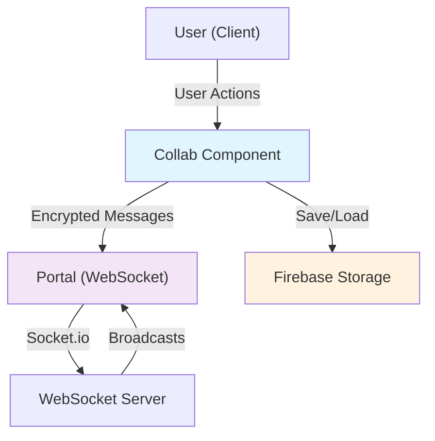

# Real-Time Collaboration

<!-- Maintained by Tidewiki. Edits are kept on later updates; wrap text in tidewiki:keep markers to freeze it. -->

Real-time collaboration allows multiple users to edit a scene simultaneously. The system handles live synchronization of element changes, cursor positions, user presence, and idle states through WebSocket connections, while managing conflicts that arise from concurrent edits.

## Architecture Overview

The collaboration system is built around two main components:

- [`excalidraw-app/collab/Collab.tsx:135-210`](../../excalidraw-app/collab/Collab.tsx#L135-L210) **Collab component**: A React component that orchestrates the overall collaboration lifecycle, managing connections, state synchronization, and file handling.
- [`excalidraw-app/collab/Portal.tsx:25-35`](../../excalidraw-app/collab/Portal.tsx#L25-L35) **Portal**: Handles low-level WebSocket communication, encryption, and message broadcasting.

## Connection and Room Management

[`excalidraw-app/collab/Collab.tsx:481-712`](../../excalidraw-app/collab/Collab.tsx#L481-L712) When collaboration starts, the system either creates a new room or joins an existing one using a room ID and encryption key. The `startCollaboration` method:

1. Generates or retrieves room link data
2. Initializes a Socket.io connection to the WebSocket server
3. Sets up socket event listeners for incoming messages
4. Initializes the idle detection system
5. Returns a promise that resolves when the initial scene is loaded

[`excalidraw-app/collab/Collab.tsx:714-759`](../../excalidraw-app/collab/Collab.tsx#L714-L759) The `initializeRoom` method loads the initial scene from Firebase, prioritizing remote data when joining an existing room to avoid conflicts with potentially stale local data.

## Synchronization and Conflict Resolution

### Scene Version Tracking

[[cite:excalidraw-app/collab/Collab.tsx:143,920-926]] The system tracks the last broadcasted or received scene version to avoid echoing back updates that were just received from remote collaborators. Each scene update increments a version number, which is compared before broadcasting.

### Element Reconciliation

[`excalidraw-app/collab/Collab.tsx:761-793`](../../excalidraw-app/collab/Collab.tsx#L761-L793) The `_reconcileElements` method handles incoming remote elements by:

1. Restoring elements to their proper state using `restoreElements`
2. Calling `reconcileElements` to merge local and remote changes
3. Bumping element versions to prevent unnecessary conflicts
4. Updating the last broadcasted version to suppress echo broadcasts

This ensures that local edits and remote updates are merged intelligently rather than simply overwriting one another.

### Delta-Based Changes

[`packages/element/src/delta.ts:76-196`](../../packages/element/src/delta.ts#L76-L196) The system uses a `Delta` class to represent differences between element states. Each delta captures both deleted and inserted properties, allowing for:

- **Forward and backward time-travel**: Deltas can be inverted for undo/redo
- **Bandwidth optimization**: Only changed properties are transmitted
- **Conflict detection**: Versions and version nonces identify which changes conflict

[`packages/element/src/delta.ts:1033-1466`](../../packages/element/src/delta.ts#L1033-L1466) The `ElementsDelta` class extends this concept to handle sets of elements, tracking added, removed, and updated elements separately. The `applyTo` method applies deltas while:

1. Resolving binding conflicts (reconnecting arrows to their targets)
2. Reordering elements based on fractional indices (z-order)
3. Redrawing text bounding boxes and dependent elements
4. Detecting whether changes result in visible differences

## Multi-User State Management

### Collaborator Presence

[`excalidraw-app/collab/Collab.tsx:875-918`](../../excalidraw-app/collab/Collab.tsx#L875-L918) Collaborators are tracked in a Map indexed by socket ID. Each collaborator stores:

- Pointer position and button state
- Selected element IDs
- Username
- User idle state (active, idle, away)
- Whether they are the current user

[`excalidraw-app/collab/Collab.tsx:620-677`](../../excalidraw-app/collab/Collab.tsx#L620-L677) Remote updates for cursor positions and idle status are received via WebSocket and stored in the collaborators map, which is then passed to the scene for rendering.

### User Following

[`excalidraw-app/collab/Collab.tsx:1004-1024`](../../excalidraw-app/collab/Collab.tsx#L1004-L1024) When a user follows another, their viewport automatically tracks the followed user's visible scene bounds. The system maintains a `followedBy` set to track which users are following the current user, and relays viewport bounds only when needed.

[`excalidraw-app/collab/Collab.tsx:639-668`](../../excalidraw-app/collab/Collab.tsx#L639-L668) Remote viewport bounds are received and applied to the app state using `zoomToFitBounds`, but only if the user is actively being followed and there is no cross-follow situation.

### Idle Detection

[`excalidraw-app/collab/Collab.tsx:821-873`](../../excalidraw-app/collab/Collab.tsx#L821-L873) The system tracks user activity through pointer movement and visibility changes. Three idle states are maintained:

- **ACTIVE**: User is actively moving the pointer or the tab is visible
- **IDLE**: User has stopped moving the pointer (after `IDLE_THRESHOLD`)
- **AWAY**: Tab is hidden or browser is in background

These states are periodically broadcast to other collaborators at intervals defined by `ACTIVE_THRESHOLD`.

## Broadcasting and Throttling

### Element Broadcasting

[`excalidraw-app/collab/Collab.tsx:960-988`](../../excalidraw-app/collab/Collab.tsx#L960-L988) Elements are broadcast in two ways:

- **Incremental updates** (`broadcastElements`): Only sends elements with versions newer than the last broadcast version
- **Periodic full syncs** (`queueBroadcastAllElements`): Throttled to `SYNC_FULL_SCENE_INTERVAL_MS`, ensures no messages are lost

[`excalidraw-app/collab/Portal.tsx:142-183`](../../excalidraw-app/collab/Portal.tsx#L142-L183) Broadcasting filters elements through `isSyncableElement` and tracks broadcasted versions to minimize redundant transmissions. Image file uploads are queued and throttled separately.

### Cursor and Metadata Broadcasting

[`excalidraw-app/collab/Collab.tsx:932-943`](../../excalidraw-app/collab/Collab.tsx#L932-L943) Pointer updates are throttled to `CURSOR_SYNC_TIMEOUT` to limit network traffic while maintaining responsiveness. [`excalidraw-app/collab/Portal.tsx:202-224`](../../excalidraw-app/collab/Portal.tsx#L202-L224) Each pointer broadcast includes the socket ID, pointer coordinates, button state, and selected element IDs so remote users can see what each collaborator is working on.

## Message Encryption and Decryption

[`excalidraw-app/collab/Collab.tsx:458-477`](../../excalidraw-app/collab/Collab.tsx#L458-L477) All WebSocket payloads are encrypted using the room key. The `decryptPayload` method decrypts incoming data and handles decryption failures gracefully by alerting the user.

[`excalidraw-app/collab/Portal.tsx:85-102`](../../excalidraw-app/collab/Portal.tsx#L85-L102) Outgoing data is encrypted before emission. The `_broadcastSocketData` method serializes data to JSON, encodes it, encrypts it with the room key, and emits it along with the initialization vector.

## File Handling

[`excalidraw-app/collab/Collab.tsx:157-205`](../../excalidraw-app/collab/Collab.tsx#L157-L205) The `FileManager` is configured to save and load files from a Firebase storage path specific to the collaboration room. Files are encrypted before upload and decrypted after download. [`excalidraw-app/collab/Collab.tsx:430-456`](../../excalidraw-app/collab/Collab.tsx#L430-L456) Image elements are fetched lazily; the system only loads images that are not already tracked and are in a "saved" state (or older than 10 seconds if forced).

[`excalidraw-app/collab/Portal.tsx:104-140`](../../excalidraw-app/collab/Portal.tsx#L104-L140) File uploads are queued and throttled. Once files are successfully saved, image element statuses are updated from "pending" to "saved" so remote collaborators know to fetch them.

## Persistence and Cleanup

### Saving to Firebase

[`excalidraw-app/collab/Collab.tsx:323-363`](../../excalidraw-app/collab/Collab.tsx#L323-L363) The `saveCollabRoomToFirebase` method persists the current scene to Firebase. It is called:

- When stopping collaboration
- Before page unload (if `beforeUnload` is not disabled)
- Periodically via `queueSaveToFirebase` throttled to `SYNC_FULL_SCENE_INTERVAL_MS`

If saving fails due to size constraints or network errors, an error indicator is shown to the user.

### Stopping Collaboration

[`excalidraw-app/collab/Collab.tsx:365-411`](../../excalidraw-app/collab/Collab.tsx#L365-L411) The `stopCollaboration` method:

1. Cancels pending broadcasts and saves
2. Saves the current scene one final time
3. Either discards remote state (hard stop) or prompts to keep it (soft stop)
4. Resets browser state versions to prevent stale tabs from overwriting changes
5. Marks image elements as "pending" to re-download them locally

## Error Handling and Indicators

[`excalidraw-app/collab/CollabError.tsx:1-54`](../../excalidraw-app/collab/CollabError.tsx#L1-L54) Collaboration errors are displayed via a `CollabError` component that shows a warning icon with a tooltip. The error indicator uses a `nonce` value that changes on each error to trigger animation re-runs even if the message is the same.

[`excalidraw-app/collab/Collab.tsx:1046-1066`](../../excalidraw-app/collab/Collab.tsx#L1046-L1066) Error indicators and dialogs are managed separately; indicators show persistent issues while dialogs dismiss after user acknowledgment.

## Decisions

**Version-based duplicate suppression**: The system avoids echoing received broadcasts by tracking the last scene version. This prevents unnecessary network traffic and UI flickering when a remote update arrives, since the sender will see their own change broadcast back if not suppressed. From [`excalidraw-app/collab/Collab.tsx:784-790`](../../excalidraw-app/collab/Collab.tsx#L784-L790).

**Lazy image loading**: Images are not fetched immediately but only when needed and when their status is "saved". This reduces initial load time and network usage for collaborative sessions with many images. From [`excalidraw-app/collab/Collab.tsx:430-456`](../../excalidraw-app/collab/Collab.tsx#L430-L456).

**Periodic full scene resync**: Despite incremental updates, the system periodically broadcasts the entire scene to handle dropped messages or server outages. This is throttled to prevent overwhelming the network. From [`excalidraw-app/collab/Collab.tsx:976-988`](../../excalidraw-app/collab/Collab.tsx#L976-L988).

**Delta-based conflict resolution**: Changes are represented as deltas that track both added and removed properties, allowing intelligent merging and the ability to resolve binding conflicts when elements are moved or deleted. From [`packages/element/src/delta.ts:1417-1422`](../../packages/element/src/delta.ts#L1417-L1422).
