# Overview

<!-- Maintained by Tidewiki. Edits are kept on later updates; wrap text in tidewiki:keep markers to freeze it. -->

Excalidraw is an open-source virtual whiteboard for creating hand-drawn style diagrams. The repository contains both the core editor library (published as an npm package) and a full web application hosted at excalidraw.com with real-time collaboration, end-to-end encryption, and local-first storage.

## What This Project Does

[`README.md:54-70`](../../README.md#L54-L70) The Excalidraw editor supports creating infinite canvas-based drawings with hand-drawn styling, a wide range of tools (shapes, arrows, freehand), image support, shape libraries, export to PNG/SVG/clipboard, undo/redo, zoom and panning, and arrow binding with labels.

The hosted web app at excalidraw.com adds PWA offline support, real-time collaboration, end-to-end encryption, local-first autosaving, and shareable readonly links.

## Architecture and Main Components

```mermaid
graph TB
    subgraph "Core Editor"
        Canvas["Canvas Rendering & Viewport"]
        Elements["Element Data Model"]
        Selection["Selection & Bounding Boxes"]
        Transform["Transformation & Manipulation"]
    end
    
    subgraph "User Interaction"
        Actions["Actions & Command System"]
        Tools["Toolbar & Tools"]
        Input["Input Handlers"]
    end
    
    subgraph "Content Features"
        Shapes["Shape Generation"]
        Text["Text Editing"]
        Arrows["Arrows & Bindings"]
        Frames["Frames & Groups"]
        Images["Image Support"]
    end
    
    subgraph "Visual & Organization"
        ZIndex["Z-Index & Ordering"]
        Snapping["Snapping & Guides"]
        Effects["Visual Effects"]
        Colors["Color System"]
    end
    
    subgraph "UI Layer"
        UIComp["UI Components"]
        Properties["Properties Panel"]
        Search["Search & Command Palette"]
        Toolbar["Toolbar UI"]
    end
    
    subgraph "Data & State"
        AppState["Application State"]
        History["Undo/Redo & History"]
        Clipboard["Clipboard & Export"]
        Library["Library & Assets"]
    end
    
    subgraph "Advanced Features"
        Collab["Real-Time Collaboration"]
        Encryption["End-to-End Encryption"]
        Storage["Storage & Persistence"]
        AI["AI & Text Generation"]
        Mermaid["Mermaid Conversion"]
    end
    
    Canvas --> Elements
    Elements --> Selection
    Selection --> Transform
    Actions --> Tools
    Actions --> Input
    Input --> Canvas
    Shapes --> Elements
    Text --> Elements
    Arrows --> Elements
    Frames --> Elements
    Images --> Elements
    ZIndex --> Elements
    Snapping --> Transform
    Effects --> Canvas
    Colors --> UIComp
    UIComp --> Properties
    UIComp --> Search
    UIComp --> Toolbar
    AppState --> History
    AppState --> Clipboard
    AppState --> Library
    Clipboard --> AppState
    History --> AppState
    Collab --> AppState
    Encryption --> Clipboard
    Storage --> AppState
    AI --> Elements
    Mermaid --> Elements
```



The system is organized into layers:

- **Core Rendering**: The canvas pipeline and viewport manage the drawing surface and interactive rendering.
- **Element Model**: All drawable objects (shapes, text, arrows, frames) use a unified data model with type checking.
- **User Input**: The actions system translates user gestures and keyboard commands into drawing operations. Tools control which drawing mode is active.
- **Spatial Operations**: Selection, bounding boxes, transformations (resize, rotate, flip, align), and z-index ordering handle element positioning and interaction.
- **Content Creation**: Specialized systems for generating shapes, handling text, binding arrows to elements, grouping, and image embedding.
- **Visual Presentation**: Snapping guides, color management, and visual effects enhance the drawing experience.
- **Application State**: Global state holds canvas data, configuration, and coordinates with the history system for undo/redo.
- **Advanced Features**: Built on top of the core, these include real-time sync, encryption, persistence, AI assistance, and Mermaid diagram conversion.

## Repository Structure

[`package.json:1-9`](../../package.json#L1-L9) The project is a monorepo using Yarn workspaces with the main app in `excalidraw-app`, reusable libraries in `packages/*`, and examples in `examples/*`.

## Running the Project

[`README.md:85`](../../README.md#L85) To run the repository locally for development, refer to the [Development Guide](https://docs.excalidraw.com/docs/introduction/development).

Alternatively, [`docker-compose.yml`](../../docker-compose.yml) a Docker Compose file is available for development setup—it builds the project and runs the app on port 3000:

```bash
docker-compose up
```

## Wiki Navigation

### Core Drawing Engine
- [Core Editor and Canvas Rendering](core-editor-canvas.md) — Main editor component, canvas rendering, and viewport management
- [Element Data Model and Types](element-data-model.md) — Fundamental data structures for all drawable objects
- [Shape Generation and Drawing](shape-generation.md) — Algorithms for shape creation, recognition, and freehand drawing
- [Element Selection and Bounding Boxes](element-selection-bounds.md) — Selection logic and collision detection
- [Element Transformation and Manipulation](element-transformation.md) — Resizing, rotating, flipping, aligning, and distributing

### Content and Features
- [Text Editing and Typography](text-editing.md) — Text creation, editing, measurement, and font management
- [Arrows and Bindings](arrows-bindings.md) — Arrow creation, endpoint binding, labels, and routing
- [Frames and Groups](frames-groups.md) — Container management and hierarchical organization
- [Image Support](image-handling.md) — Image import, embedding, and manipulation
- [Z-Index and Element Ordering](z-index-ordering.md) — Layering system and efficient reordering

### User Interaction
- [Actions and Command System](actions-system.md) — User actions, command registration, and shortcuts
- [Toolbar and Tools](toolbar-tools.md) — Tool selection interface and tool-specific UI
- [Properties and Stats Panel](properties-panel.md) — Element properties display and editing
- [Search and Command Palette](search-command.md) — Quick search and command discovery
- [Snapping and Alignment Guides](snapping-guides.md) — Grid snapping, object snapping, and visual guides

### Visual and Effects
- [Color Picker and Color System](color-system.md) — Color management and picker interface
- [Visual Effects and Animation](canvas-effects.md) — Canvas animations, trails, and laser pointer effects
- [Bucket Fill Tool](bucket-fill.md) — Flood-fill algorithm and color application

### Data and State Management
- [Application State Management](app-state.md) — Global state, updates, and observers
- [Undo/Redo and History](undo-redo-history.md) — History management and transaction handling
- [Clipboard and Data Export](clipboard-export.md) — Copy/paste and format conversion
- [File Formats and Data Restoration](file-formats-restore.md) — Excalidraw file format and data migration

### Advanced Features
- [Real-Time Collaboration](collaboration.md) — Live collaboration and synchronization
- [End-to-End Encryption](encryption-security.md) — Encryption, decryption, and key management
- [Storage and Persistence](storage-persistence.md) — Local and cloud storage
- [Library and Asset Management](library-system.md) — Shape library and asset organization
- [AI and Text Generation](ai-features.md) — AI-powered features and text-to-diagram

### Utilities and Special Features
- [Mermaid Diagram Conversion](mermaid-conversion.md) — Converting Mermaid syntax to Excalidraw elements
- [UI Components Library](ui-components.md) — Reusable React components
- [Mathematical Utilities and Geometry](math-geometry.md) — Geometric calculations and helper functions
