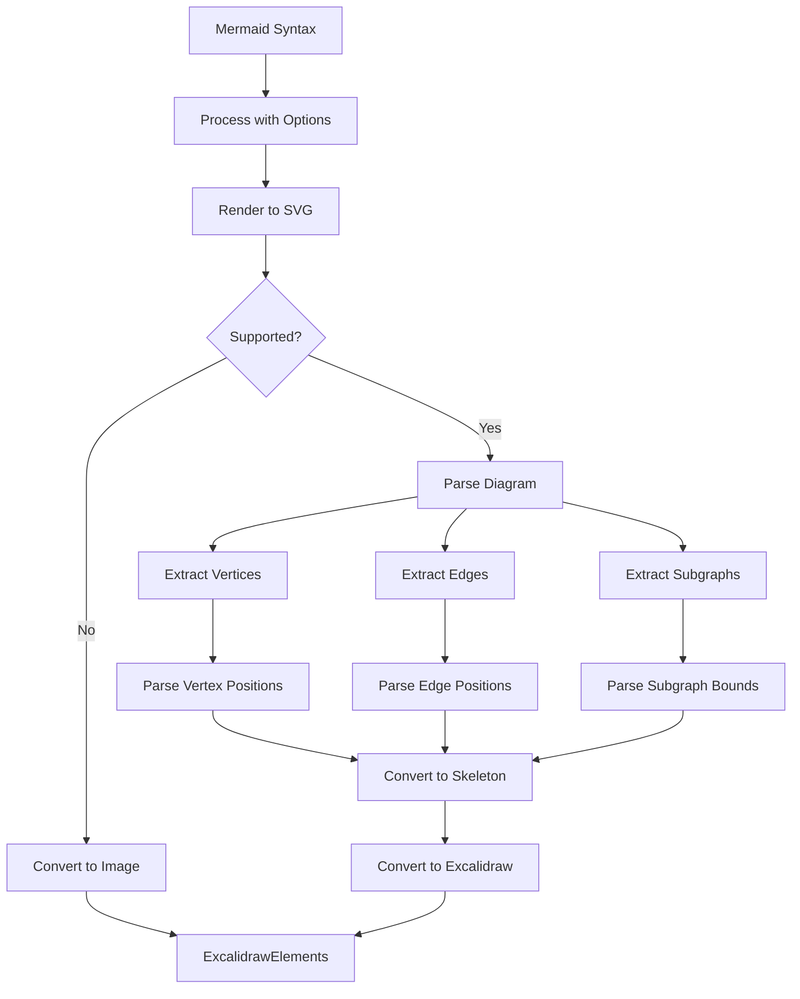

# Mermaid Diagram Conversion

<!-- Maintained by Tidewiki. Edits are kept on later updates; wrap text in tidewiki:keep markers to freeze it. -->

Conversion from Mermaid syntax to Excalidraw elements, including parsing, diagram generation, and element transformation.

## Overview

The `@excalidraw/mermaid-to-excalidraw` package converts Mermaid diagram definitions into Excalidraw elements that can be rendered in the editor. [`dev-docs/docs/@excalidraw/mermaid-to-excalidraw/api.mdx:3`](../../dev-docs/docs/@excalidraw/mermaid-to-excalidraw/api.mdx#L3) The conversion happens in two steps: first, `parseMermaidToExcalidraw()` parses the Mermaid syntax and returns skeleton elements; then `convertToExcalidrawElements()` converts those skeleton elements into fully qualified Excalidraw elements. [`dev-docs/docs/@excalidraw/mermaid-to-excalidraw/api.mdx:5`](../../dev-docs/docs/@excalidraw/mermaid-to-excalidraw/api.mdx#L5)

## Supported Diagram Types

### Flowcharts

Currently, only flowcharts are fully supported. [`dev-docs/docs/@excalidraw/mermaid-to-excalidraw/api.mdx:29`](../../dev-docs/docs/@excalidraw/mermaid-to-excalidraw/api.mdx#L29)

**Fully supported shapes:**
- Rectangles, circles, diamonds, and arrows [`dev-docs/docs/@excalidraw/mermaid-to-excalidraw/api.mdx:35`](../../dev-docs/docs/@excalidraw/mermaid-to-excalidraw/api.mdx#L35)
- Subgraphs, which map to Excalidraw groups [`dev-docs/docs/@excalidraw/mermaid-to-excalidraw/api.mdx:59`](../../dev-docs/docs/@excalidraw/mermaid-to-excalidraw/api.mdx#L59)

**Shapes with fallbacks:**
- Subroutine, cylindrical, asymmetric, hexagon, parallelogram, and trapezoid shapes fall back to rectangles [`dev-docs/docs/@excalidraw/mermaid-to-excalidraw/api.mdx:79`](../../dev-docs/docs/@excalidraw/mermaid-to-excalidraw/api.mdx#L79)
- Markdown strings in text fall back to regular text [`dev-docs/docs/@excalidraw/mermaid-to-excalidraw/api.mdx:96`](../../dev-docs/docs/@excalidraw/mermaid-to-excalidraw/api.mdx#L96)
- FontAwesome icons are not rendered and are omitted [`dev-docs/docs/@excalidraw/mermaid-to-excalidraw/api.mdx:106`](../../dev-docs/docs/@excalidraw/mermaid-to-excalidraw/api.mdx#L106)
- Cross arrow heads fall back to bar arrow heads [`dev-docs/docs/@excalidraw/mermaid-to-excalidraw/api.mdx:118`](../../dev-docs/docs/@excalidraw/mermaid-to-excalidraw/api.mdx#L118)

### Unsupported Diagram Types

All other Mermaid diagram types (ER, gitGraph, sequence, class, state, etc.) are rendered as images in Excalidraw. [`dev-docs/docs/@excalidraw/mermaid-to-excalidraw/api.mdx:129`](../../dev-docs/docs/@excalidraw/mermaid-to-excalidraw/api.mdx#L129)

## Parsing Pipeline



### Step 1: Mermaid Processing

The input Mermaid definition is processed with options (e.g., `fontSize`) and combined with Mermaid directives. [`dev-docs/docs/@excalidraw/mermaid-to-excalidraw/codebase/parser/parser.mdx:38`](../../dev-docs/docs/@excalidraw/mermaid-to-excalidraw/codebase/parser/parser.mdx#L38)

### Step 2: SVG Rendering

The Mermaid library's `mermaid.render` API generates an SVG representation of the diagram. [`dev-docs/docs/@excalidraw/mermaid-to-excalidraw/codebase/parser/parser.mdx:28`](../../dev-docs/docs/@excalidraw/mermaid-to-excalidraw/codebase/parser/parser.mdx#L28) For unsupported diagrams, this SVG is converted to a `dataURL` and rendered as an image.

### Step 3: Diagram Parsing

For supported diagram types, the Mermaid diagram is parsed using `mermaid.mermaidAPI.getDiagramFromText()` to extract the diagram structure. [`dev-docs/docs/@excalidraw/mermaid-to-excalidraw/codebase/parser/parser.mdx:45`](../../dev-docs/docs/@excalidraw/mermaid-to-excalidraw/codebase/parser/parser.mdx#L45)

## Flowchart Parser Details

The flowchart parser extracts three key components from the Mermaid parser:

### Vertices

Vertices are extracted using `diagram.parser.yy.getVertices()`. [`dev-docs/docs/@excalidraw/mermaid-to-excalidraw/codebase/parser/flowchart.mdx:19`](../../dev-docs/docs/@excalidraw/mermaid-to-excalidraw/codebase/parser/flowchart.mdx#L19) The `parseVertex` function augments this data by extracting position and dimensions from the SVG. [`dev-docs/docs/@excalidraw/mermaid-to-excalidraw/codebase/parser/flowchart.mdx:45`](../../dev-docs/docs/@excalidraw/mermaid-to-excalidraw/codebase/parser/flowchart.mdx#L45)

### Edges

Edges (lines and arrows) are extracted using `diagram.parser.yy.getEdges()`. [`dev-docs/docs/@excalidraw/mermaid-to-excalidraw/codebase/parser/flowchart.mdx:80`](../../dev-docs/docs/@excalidraw/mermaid-to-excalidraw/codebase/parser/flowchart.mdx#L80) The `parseEdge` function computes start and end coordinates, reflection points for curved paths, and arrow styling. [`dev-docs/docs/@excalidraw/mermaid-to-excalidraw/codebase/parser/flowchart.mdx:97`](../../dev-docs/docs/@excalidraw/mermaid-to-excalidraw/codebase/parser/flowchart.mdx#L97)

### Subgraphs

Subgraphs are extracted using `diagram.parser.yy.getSubgraphs()` and represent groups of elements. [`dev-docs/docs/@excalidraw/mermaid-to-excalidraw/codebase/parser/flowchart.mdx:135`](../../dev-docs/docs/@excalidraw/mermaid-to-excalidraw/codebase/parser/flowchart.mdx#L135) The `parseSubgraph` function computes bounding box positions and dimensions from the SVG. [`dev-docs/docs/@excalidraw/mermaid-to-excalidraw/codebase/parser/flowchart.mdx:153`](../../dev-docs/docs/@excalidraw/mermaid-to-excalidraw/codebase/parser/flowchart.mdx#L153)

## Conversion to ExcalidrawElementSkeleton

After parsing, the diagram data is transformed into `ExcalidrawElementSkeleton` format. [`dev-docs/docs/@excalidraw/mermaid-to-excalidraw/codebase/parser/parser.mdx:58`](../../dev-docs/docs/@excalidraw/mermaid-to-excalidraw/codebase/parser/parser.mdx#L58) For flowcharts, the `FlowChartToExcalidrawSkeletonConverter` performs this transformation. [`dev-docs/docs/@excalidraw/mermaid-to-excalidraw/codebase/parser/parser.mdx:63`](../../dev-docs/docs/@excalidraw/mermaid-to-excalidraw/codebase/parser/parser.mdx#L63)

## API Usage

```ts
import { parseMermaidToExcalidraw } from "@excalidraw/mermaid-to-excalidraw";
import { convertToExcalidrawElements } from "@excalidraw/excalidraw";

try {
  const { elements, files } = await parseMermaidToExcalidraw(mermaidSyntax, {
    fontSize: number,
  });
  const excalidrawElements = convertToExcalidrawElements(elements);
  // Render elements and files on Excalidraw
} catch (e) {
  // Parse error handling
}
```

[`dev-docs/docs/@excalidraw/mermaid-to-excalidraw/api.mdx:13-25`](../../dev-docs/docs/@excalidraw/mermaid-to-excalidraw/api.mdx#L13-L25)

## Adding New Diagram Types

To support a new Mermaid diagram type:

1. Add the diagram type to `SUPPORTED_DIAGRAM_TYPES` constant [`dev-docs/docs/@excalidraw/mermaid-to-excalidraw/codebase/new-diagram-type.mdx:17`](../../dev-docs/docs/@excalidraw/mermaid-to-excalidraw/codebase/new-diagram-type.mdx#L17)

2. Create a parser file `{{diagramType}}.ts` in `src/parser` that implements `parseMermaid{{diagramType}}Diagram()`. This parser must determine element connections and use the SVG to extract positions and dimensions. [`dev-docs/docs/@excalidraw/mermaid-to-excalidraw/codebase/new-diagram-type.mdx:25`](../../dev-docs/docs/@excalidraw/mermaid-to-excalidraw/codebase/new-diagram-type.mdx#L25)

3. Add the diagram type to the switch case in `parseMermaid()` [`dev-docs/docs/@excalidraw/mermaid-to-excalidraw/codebase/new-diagram-type.mdx:37`](../../dev-docs/docs/@excalidraw/mermaid-to-excalidraw/codebase/new-diagram-type.mdx#L37)

4. Create a converter `{{diagramType}}ToExcalidrawSkeletonConverter` that transforms parsed data into `ExcalidrawElementSkeleton` format [`dev-docs/docs/@excalidraw/mermaid-to-excalidraw/codebase/new-diagram-type.mdx:43`](../../dev-docs/docs/@excalidraw/mermaid-to-excalidraw/codebase/new-diagram-type.mdx#L43)

5. Add test cases to the playground [`dev-docs/docs/@excalidraw/mermaid-to-excalidraw/codebase/new-diagram-type.mdx:49`](../../dev-docs/docs/@excalidraw/mermaid-to-excalidraw/codebase/new-diagram-type.mdx#L49)

## Related Pages

- [Shape Generation and Drawing](shape-generation.md) — Element creation for Mermaid shapes
- [Arrows and Bindings](arrows-bindings.md) — Handling arrow creation and connections
- [Frames and Groups](frames-groups.md) — Mapping Mermaid subgraphs to Excalidraw groups
- [Element Data Model and Types](element-data-model.md) — ExcalidrawElementSkeleton format
- [Text Editing and Typography](text-editing.md) — Text handling in converted diagrams
