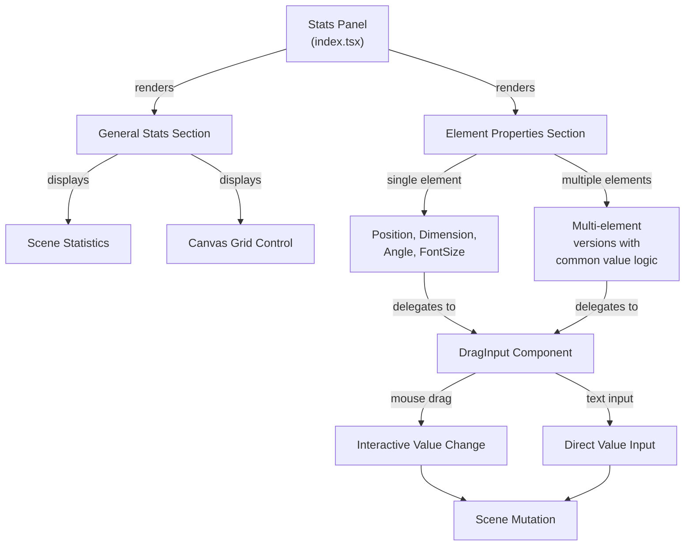

# Properties and Stats Panel

<!-- Maintained by Tidewiki. Edits are kept on later updates; wrap text in tidewiki:keep markers to freeze it. -->

The Properties and Stats Panel provides detailed information about selected elements, including their dimensions, position, angle, and visual properties. It allows users to view and edit these measurements through an interactive interface, with support for single and multiple element selections.

## Overview

The stats panel displays two main sections:

1. **General Stats**: Scene-wide information like total number of shapes and canvas dimensions
2. **Element Properties**: Detailed properties of selected element(s) including position (X, Y), dimensions (width, height), rotation angle, and font size for text elements

The panel supports both single-element and multi-element selection, with special handling for grouped elements and frames. Users can edit properties by dragging input labels or typing values directly.

## Architecture

## Key Components

### DragInput [`packages/excalidraw/components/Stats/DragInput.tsx:1-100`](../../packages/excalidraw/components/Stats/DragInput.tsx#L1-L100)

The core interactive input component that supports both dragging the label and typing values. [`packages/excalidraw/components/Stats/DragInput.tsx:73-89`](../../packages/excalidraw/components/Stats/DragInput.tsx#L73-L89) It tracks pointer movement to accumulate changes and fires callbacks at configurable sensitivity. The component preserves original element state during interactions and supports step-sized increments when Shift is held.

### Stats Panel [`packages/excalidraw/components/Stats/index.tsx:115-180`](../../packages/excalidraw/components/Stats/index.tsx#L115-L180)

The main panel container [`packages/excalidraw/components/Stats/index.tsx:115-143`](../../packages/excalidraw/components/Stats/index.tsx#L115-L143) that determines which stats to display based on selection state. It memoizes atomic units (grouping elements that should be resized together) and throttles scene dimension calculations.

### Single-Element Components

For individual elements, specialized components handle property editing:

- **Position** [`packages/excalidraw/components/Stats/Position.tsx:175-209`](../../packages/excalidraw/components/Stats/Position.tsx#L175-L209): Edits X/Y coordinates while accounting for element rotation and crop mode
- **Dimension** [`packages/excalidraw/components/Stats/Dimension.tsx:320-359`](../../packages/excalidraw/components/Stats/Dimension.tsx#L320-L359): Edits width/height with aspect ratio preservation for images
- **Angle** [`packages/excalidraw/components/Stats/Angle.tsx:87-101`](../../packages/excalidraw/components/Stats/Angle.tsx#L87-L101): Rotates elements in degrees (0-360), updating bound text if present
- **FontSize** [`packages/excalidraw/components/Stats/FontSize.tsx:80-103`](../../packages/excalidraw/components/Stats/FontSize.tsx#L80-L103): Adjusts font size for text elements and elements with bound text

### Multi-Element Components

When multiple elements are selected, these components display common values or "Mixed" when they differ:

- **MultiPosition** [`packages/excalidraw/components/Stats/MultiPosition.tsx:223-271`](../../packages/excalidraw/components/Stats/MultiPosition.tsx#L223-L271): Moves multiple elements or groups as units
- **MultiDimension** [`packages/excalidraw/components/Stats/MultiDimension.tsx:431-481`](../../packages/excalidraw/components/Stats/MultiDimension.tsx#L431-L481): Resizes element groups while maintaining aspect ratios and internal relationships
- **MultiAngle** [`packages/excalidraw/components/Stats/MultiAngle.tsx:102-133`](../../packages/excalidraw/components/Stats/MultiAngle.tsx#L102-L133): Rotates multiple individual elements
- **MultiFontSize** [`packages/excalidraw/components/Stats/MultiFontSize.tsx:127-159`](../../packages/excalidraw/components/Stats/MultiFontSize.tsx#L127-L159): Adjusts font size for multiple text elements

## Property Editing

### Interaction Flow

[`packages/excalidraw/components/Stats/DragInput.tsx:228-346`](../../packages/excalidraw/components/Stats/DragInput.tsx#L228-L346) Users can interact with properties in two ways:

1. **Drag the label**: Moving the mouse horizontally triggers `onPointerDown` on the label, which tracks movement and accumulates changes
2. **Type in the input**: Direct text input that's submitted on Enter or blur

Both paths call the `dragInputCallback` with change information, which then calls `scene.mutateElement()` to update the element.

### Handling Grouped Elements

[`packages/excalidraw/components/Stats/utils.ts:235-254`](../../packages/excalidraw/components/Stats/utils.ts#L235-L254) Atomic units group elements that should resize together. When resizing a group, the code maintains aspect ratio and scales all contained elements proportionally. [`packages/excalidraw/components/Stats/MultiDimension.tsx:114-150`](../../packages/excalidraw/components/Stats/MultiDimension.tsx#L114-L150)

### Position and Rotation

Properties account for element rotation. The panel calculates the top-left corner position after rotation transformation [`packages/excalidraw/components/Stats/Position.tsx:175-181`](../../packages/excalidraw/components/Stats/Position.tsx#L175-L181) using `pointRotateRads()`, so displayed coordinates match visual position on the canvas.

## Special Cases

### Crop Mode

When an image is being cropped, [`packages/excalidraw/components/Stats/Dimension.tsx:67-166`](../../packages/excalidraw/components/Stats/Dimension.tsx#L67-L166) the dimension and position inputs operate on crop coordinates rather than element bounds. The crop offset and natural image dimensions are tracked separately.

### Frames and Children

When resizing a frame, the panel detects which elements should be added or removed from frame membership based on new bounds. [`packages/excalidraw/components/Stats/Dimension.tsx:200-216`](../../packages/excalidraw/components/Stats/Dimension.tsx#L200-L216) This is handled through `getElementsInResizingFrame()` and `replaceAllElementsInFrame()`.

### Text Elements

[`packages/excalidraw/components/Stats/FontSize.tsx:32-78`](../../packages/excalidraw/components/Stats/FontSize.tsx#L32-L78) Font size changes trigger `redrawTextBoundingBox()` to recalculate text layout. For bound text (text inside shapes), the panel can edit font size through the container element. [`packages/excalidraw/components/Stats/index.tsx`](../../packages/excalidraw/components/Stats/index.tsx)

## Related Pages

- [Element Data Model and Types](element-data-model.md) — Element structure and properties
- [Element Transformation and Manipulation](element-transformation.md) — How elements are resized and moved
- [Text Editing and Typography](text-editing.md) — Text element handling
- [Frames and Groups](frames-groups.md) — Group and frame behavior
- [Element Selection and Bounding Boxes](element-selection-bounds.md) — Selection and bounds calculation
